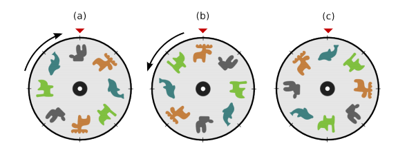

## Problem H. Jaeha’s Safe

Jaeha just bought a new children’s safe to store his valuables.  
The safe uses a dial to lock the door, and on the rim of dial are drawn pictures of cute animals instead of numbers.  
To open the safe, Jaeha must rotate the dial to reach certain positions, alternating direction each time.  
  

The above pictures show an example of how the safe can be opened.  
Picture (a) shows the dial’s current position. Jaeha needs to rotate the dial clockwise until position (b) is reached. Then Jaeha needs to rotate the dial counterclockwise until position (c) appears, and then the safe will open.  
Jaeha wants to be careful, so he only rotates the dial one tick at a time. A tick means a picture drawn
on the rim of the dial. Therefore, to open the safe in the above example, Jaeha needs to rotate 4 ticks to reach position (b) and 6 ticks to reach position (c), totalling 10 ticks.  
Like his father, Jaeha is an impatient child. Let’s help him out by writing a program that, given a set of dial positions, calculate how many ticks Jaeha has to rotate the dial to open the safe.  

### Input
The input consists of T test cases. The number of test cases T is given in the first line of the input.  
The first line of each test case will contain an integer N(1 ≤ N ≤ 50), the number of positions Jaeha needs to reach. The next N + 1 lines will each contain a dial configuration.  
A configuration is given by listing the pictures in clockwise order, starting from the topmost picture. Each type of picture is denoted by an alphabet character, therefore each configuration is given as a string.  
The first configuration shows the current dial. Jaeha will rotate clockwise to reach the second configuration, rotate counterclockwise to reach the third, and so on.  
The number of pictures on a dial will not exceed 10,000.  
Two adjacent configurations given in the input will always be different. It is always possible to open the safe.  

### Output
Print exactly one line for each test case.  
The line should contain the minimum number of ticks required to open the safe.  
